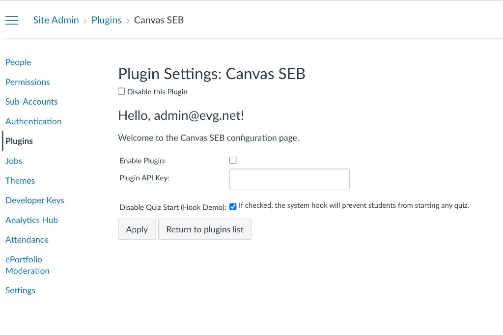
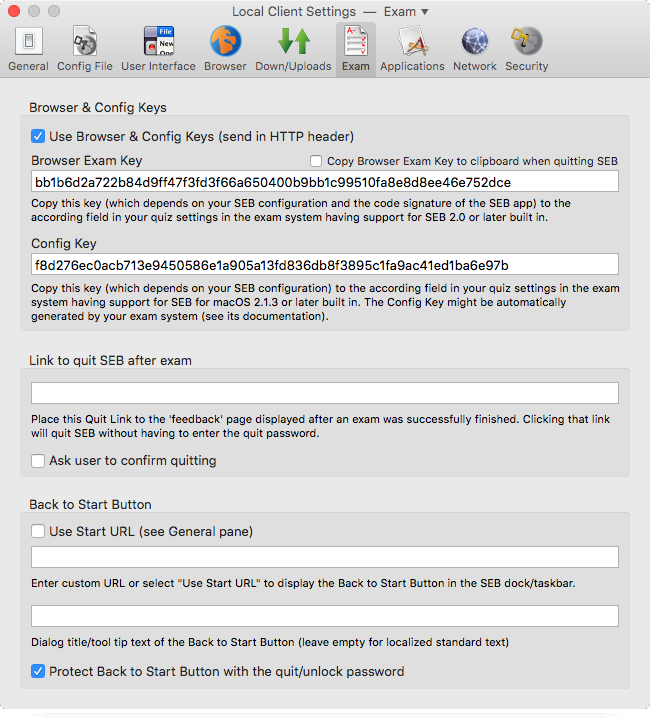
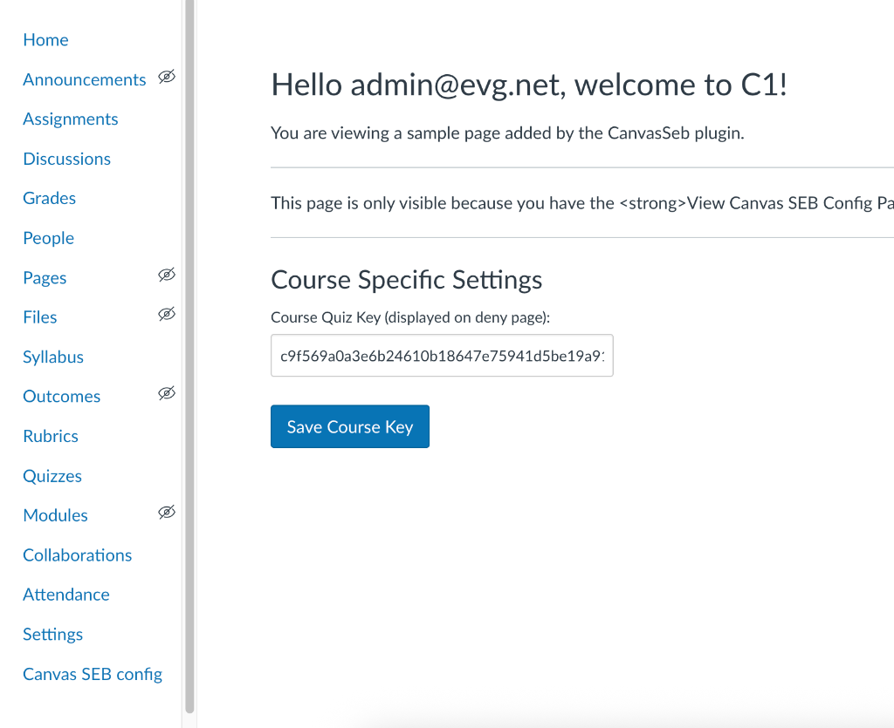

# Canvas SEB Plugin

The **Canvas SEB** plugin provides integration between Canvas LMS and Safe Exam Browser (SEB). It allows for global and course-level enforcement of SEB configurations to ensure exam integrity.

## User Guide

### 1. Enable the Plugin
Site administrators can enable the plugin via the Canvas Plugin settings:
1. Navigate to **Site Admin** > **Plugins**.
2. Find **Canvas SEB** in the list.
3. Check the **Enable Plugin** box.
4. (Optional) Check **Disable Quiz SEB** to activate the global enforcement hook.

### 2. Configure Safe Exam Browser
In your Safe Exam Browser client settings:
1. Navigate to the **Exam** tab.
2. Enable **Use Browser & Config Keys (send in HTTP header)**.
3. Copy the **Config Key**.

### 3. Update Config Key in Course Settings
Once the plugin is enabled, teachers can configure it for their courses:
1. Navigate to your Course.
2. Click on **Canvas SEB config** in the course navigation menu.
3. Paste the **Config Key** into the **Course Quiz Key** field.
4. Click **Save Course Key**.

### 4. Student Experience
If enforcement is active and a student attempts to start a quiz without the correct SEB configuration:
- They will be redirected to a "Quiz Disabled" page.
- The page will display debug information (IP, User-Agent, and Hash status) to help troubleshoot why their SEB client was rejected.

---

## Developer Documentation

### Installation
The plugin is located in `gems/plugins/canvas_seb`. It is registered in the main Canvas `Gemfile.d/plugins.rb` (if added there).

### Core Components
- **`CanvasSeb::Engine`**: Handles plugin registration, sets up permissions, and applies Ruby `prepend` extensions to core Canvas classes.
- **`CanvasSeb::QuizExtension`**: Intercepts `Quizzes::Quiz#generate_submission` to block quiz starts at the model level if SEB requirements aren't met.
- **`CanvasSeb::QuizzesControllerExtension`**: Intercepts `Quizzes::QuizzesController#show` and `#start_quiz!` to capture request headers and perform redirects.

### Validation Mechanism
The plugin uses a SHA256 HMAC-like validation:
- **Input**: The current request URL concatenated with the `course_seb_key`.
- **Header**: Expects the `X-SafeExamBrowser-ConfigKeyHash` header to be sent by the SEB client.
- **Comparison**: Access is granted only if the header matches `Digest::SHA256.hexdigest(url + course_key)`.

### Background Workers
A sample worker is provided in `lib/canvas_seb/worker.rb`. It can be enqueued for background processing tasks related to SEB logs or configuration updates.

### API
The plugin provides a namespaced API for health checks and job triggering:
- `GET /api/v1/canvas_seb`
- `POST /api/v1/canvas_seb/trigger_worker`

### Working with the Code
- **Permissions**: Defined in `engine.rb`. Default roles include Teachers and Admins for management.
- **Templates**: All UI elements are standard Rails ERB templates located in `app/views`.
- **Logging**: All SEB-related activity is logged to the Rails log with the prefix `[Canvas SEB]`.

---

## Roadmap / TODO
- [ ] **SEB Configuration Upload**: Implement functionality for teachers to upload `.seb` configuration files directly to the course settings.
- [ ] **Student Download Module**: Create a module/link on the course page that allows students to download the required `.seb` configuration file for their course.

